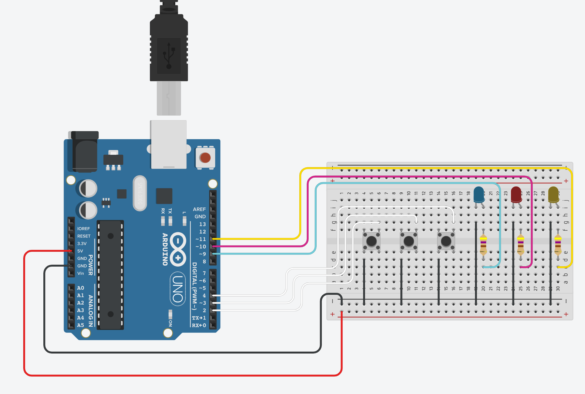
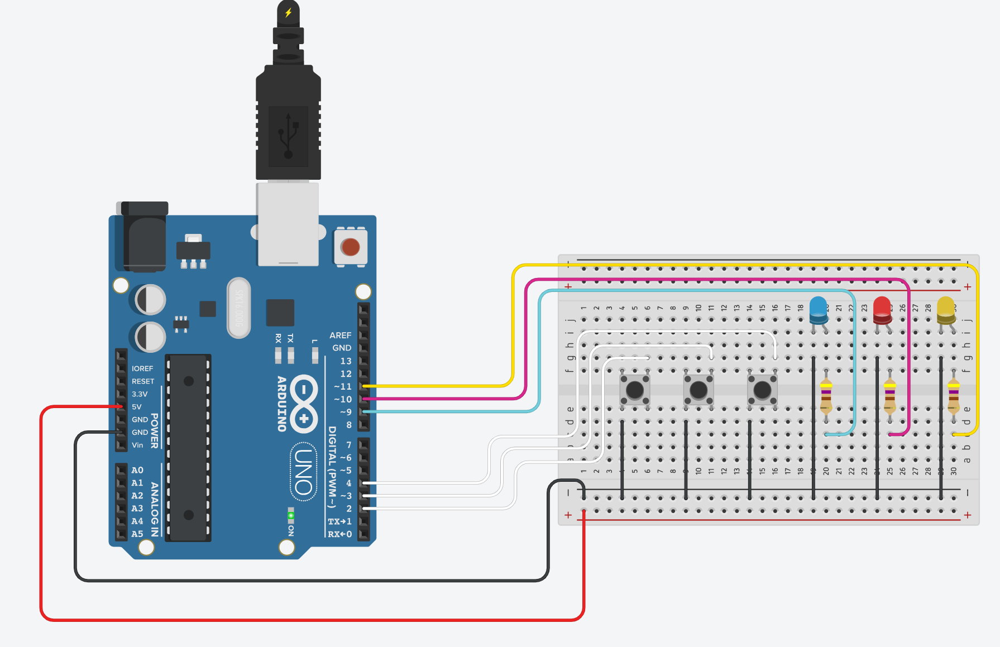

# arduino-led-buttons
This project controls LEDs using push buttons on Arduino UNO.

A simple interactive Arduino UNO project to control 3 LEDs (Blue, Red, Yellow) using 3 push buttons.  
Each button is wired to either turn ON or OFF a specific LED.

---

# Project Preview

Below are screenshots of the project simulation in Tinkercad:

# 🔴 All LEDs OFF


# 🟢 LEDs ON After Button Press


---

# Try It Yourself

You can try the full simulation here:  
[View on Tinkercad](https://www.tinkercad.com/things/0PPjGCHGqF2-exquisite-gaaris-fyyran)

Click "**Start Simulation**" to see how the buttons control each LED.

---

# Components Used

- 1x Arduino UNO
- 3x LEDs (Blue, Red, Yellow)
- 3x Push Buttons
- 3x 470Ω Resistors
- Breadboard
- Jumper Wires

---

# Arduino Code Example

This example turns a single LED (connected to pin 9) ON and OFF with delay.
For the full button logic, refer to the `led_control.ino` file.

```cpp
const int blueLed = 9;

void setup() {
  pinMode(blueLed, OUTPUT);
}

void loop() {
  digitalWrite(blueLed, HIGH);
  delay(500);
  digitalWrite(blueLed, LOW);
  delay(500);
}
